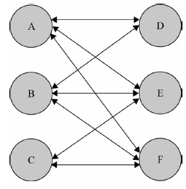
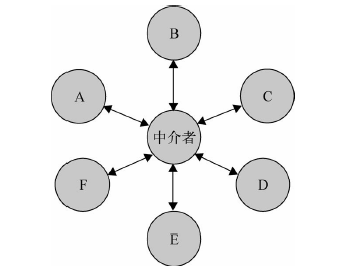

# 中介者模式

## 一、由来

程序由大大小小的单一对象组成，所有这些对象都按照某种关系和规则来通信，面向对象设计鼓励将行为分布到各个对象中，把对象划分成更小的粒度，有助于增强对象的可复用性，但由于这些细粒度对象之间的联系激增，又有可能会反过来降低它们的可复用性。

中介者模式的作用就是解除对象与对象之间的紧耦合关系。增加一个中介者对象后，所有的相关对象都通过中介者对象来通信，而不是互相引用，所以当一个对象发生改变时，只需要通知中介者对象即可。中介者使各对象之间耦合松散，而且可以独立地改变它们之间的交互。中介者模式使网状的多对多关系变成了相对简单的一对多关系。

##           →   


如上图，如果对象A 发生了改变，则需要同时通知跟A 发生引用关系的B、D、E、F这4 个对象；使用中介者模式改进之后，A 发生改变时则只需要通知这个中介者对象即可。

## 二、实例

### 1.游戏玩家对象之间的关系

> 各个玩家的加入和退出，以及更换队伍，与其他玩家之间应该是互不相关的，可以各自独立，只需要通知中介者即可；

使用中介者模式之前

```js
// ---------------------- 使用中介者之前 ----------------------------
var players = []; // 所有队的全部玩家

// 玩家构造函数
function Player(name, teamColor) {
    this.partners = []; // 队友列表
    this.enemies = []; // 敌人列表
    this.state = "live"; // 玩家状态
    this.name = name; // 角色名字
    this.teamColor = teamColor; // 队伍颜色
}
Player.prototype.win = function () {
    console.log(this.name + " won ");
};
Player.prototype.lose = function () {
    console.log(this.name + " lost");
};
Player.prototype.die = function () {
    var all_dead = true;
    this.state = "dead"; // 设置玩家状态为死亡
    for (var i = 0, partner; (partner = this.partners[i++]); ) {
        // 遍历队友列表
        if (partner.state !== "dead") {
            // 如果还有一个队友没有死亡，则游戏还未失败
            all_dead = false;
            break;
        }
    }
    if (all_dead === true) {
        // 如果队友全部死亡
        this.lose(); // 通知自己游戏失败
        for (var i = 0, partner; (partner = this.partners[i++]); ) {
            // 通知所有队友玩家游戏失败
            partner.lose();
        }
        for (var i = 0, enemy; (enemy = this.enemies[i++]); ) {
            // 通知所有敌人游戏胜利
            enemy.win();
        }
    }
};

// 最后定义一个工厂来创建玩家：
var playerFactory = function (name, teamColor) {
    var newPlayer = new Player(name, teamColor); // 创建新玩家
    for (var i = 0, player; (player = players[i++]); ) {
        // 通知所有的玩家，有新角色加入
        if (player.teamColor === newPlayer.teamColor) {
            // 如果是同一队的玩家
            player.partners.push(newPlayer); // 相互添加到队友列表
            newPlayer.partners.push(player);
        } else {
            player.enemies.push(newPlayer); // 相互添加到敌人列表
            newPlayer.enemies.push(player);
        }
    }
    players.push(newPlayer);
    return newPlayer;
};
//红队：
var player1 = playerFactory("皮蛋", "red"),
    player2 = playerFactory("小乖", "red"),
    player3 = playerFactory("宝宝", "red"),
    player4 = playerFactory("小强", "red");
//蓝队：
var player5 = playerFactory("黑妞", "blue"),
    player6 = playerFactory("葱头", "blue"),
    player7 = playerFactory("胖墩", "blue"),
    player8 = playerFactory("海盗", "blue");
// 让红队玩家全部死亡：
player1.die();
player2.die();
player4.die();
player3.die();
```

使用中介者模式后

```js
function Player(name, teamColor) {
    this.name = name; // 角色名字
    this.teamColor = teamColor; // 队伍颜色
    this.state = "alive"; // 玩家生存状态
}
Player.prototype.win = function () {
    console.log(this.name + " won ");
};
Player.prototype.lose = function () {
    console.log(this.name + " lost");
};
/*******************玩家死亡*****************/
Player.prototype.die = function () {
    this.state = "dead";
    playerDirector.reciveMessage("playerDead", this); // 给中介者发送消息，玩家死亡
};
/*******************移除玩家*****************/
Player.prototype.remove = function () {
    playerDirector.reciveMessage("removePlayer", this); // 给中介者发送消息，移除一个玩家
};
/*******************玩家换队*****************/
Player.prototype.changeTeam = function (color) {
    playerDirector.reciveMessage("changeTeam", this, color); // 给中介者发送消息，玩家换队
};
// 工厂函数创建玩家
var playerFactory = function (name, teamColor) {
    var newPlayer = new Player(name, teamColor); // 创造一个新的玩家对象
    playerDirector.reciveMessage("addPlayer", newPlayer); // 给中介者发送消息，新增玩家
    return newPlayer;
};

// 中介者, 专门处理各种关系
var playerDirector = (function () {
    var players = {}, // 保存所有玩家
        operations = {}; // 中介者可以执行的操作
    /****************新增一个玩家***************************/
    operations.addPlayer = function (player) {
        var teamColor = player.teamColor; // 玩家的队伍颜色
        players[teamColor] = players[teamColor] || []; // 如果该颜色的玩家还没有成立队伍，则
        新成立一个队伍;
        players[teamColor].push(player); // 添加玩家进队伍
    };
    /****************移除一个玩家***************************/
    operations.removePlayer = function (player) {
        var teamColor = player.teamColor, // 玩家的队伍颜色
            teamPlayers = players[teamColor] || []; // 该队伍所有成员
        for (var i = teamPlayers.length - 1; i >= 0; i--) {
            // 遍历删除
            if (teamPlayers[i] === player) {
                teamPlayers.splice(i, 1);
            }
        }
    };
    /****************玩家换队***************************/
    operations.changeTeam = function (player, newTeamColor) {
        // 玩家换队
        operations.removePlayer(player); // 从原队伍中删除
        player.teamColor = newTeamColor; // 改变队伍颜色
        operations.addPlayer(player); // 增加到新队伍中
    };
    operations.playerDead = function (player) {
        // 玩家死亡
        var teamColor = player.teamColor,
            teamPlayers = players[teamColor]; // 玩家所在队伍
        var all_dead = true;
        for (var i = 0, player; (player = teamPlayers[i++]); ) {
            if (player.state !== "dead") {
                all_dead = false;
                break;
            }
        }
        if (all_dead === true) {
            // 全部死亡
            for (var i = 0, player; (player = teamPlayers[i++]); ) {
                player.lose(); // 本队所有玩家lose
            }
            for (var color in players) {
                if (color !== teamColor) {
                    var teamPlayers = players[color]; // 其他队伍的玩家
                    for (var i = 0, player; (player = teamPlayers[i++]); ) {
                        player.win(); // 其他队伍所有玩家win
                    }
                }
            }
        }
    };
    var reciveMessage = function () {
        var message = Array.prototype.shift.call(arguments); // arguments 的第一个参数为消息名称
        operations[message].apply(this, arguments);
    };
    return {
        reciveMessage: reciveMessage,
    };
})();

//  运行测试
// 红队：
var player1 = playerFactory("皮蛋", "red"),
    player2 = playerFactory("小乖", "red"),
    player3 = playerFactory("宝宝", "red"),
    player4 = playerFactory("小强", "red");
// 蓝队：
var player5 = playerFactory("黑妞", "blue"),
    player6 = playerFactory("葱头", "blue"),
    player7 = playerFactory("胖墩", "blue"),
    player8 = playerFactory("海盗", "blue");
player1.die();
player2.die();
player3.die();
player4.die();
```

### 2.购物车中的物品各种属性对象之间的关系

某个属性的商品库存不足时给提示，没有输入数量时给提示，各个属性之间的关系较复杂，可以抽出来交给中介者

```js
<!DOCTYPE html>
<html lang="en">
  <head>
    <meta charset="UTF-8" />
    <meta http-equiv="X-UA-Compatible" content="IE=edge" />
    <meta name="viewport" content="width=device-width, initial-scale=1.0" />
    <title>Document</title>
  </head>
  <body>
    选择颜色:
    <select id="colorSelect">
      <option value="">请选择</option>
      <option value="red">红色</option>
      <option value="blue">蓝色</option>
    </select>
    选择内存
    <select id="memorySelect">
      <option value="">请选择</option>
      <option value="128">128G</option>
      <option value="256">256G</option>
    </select>
    输入购买数量: <input type="text" id="numberInput" />
    <br />
    您选择了颜色:
    <div id="colorInfo"></div>
    <br />
    您选择了内存:
    <div id="memoryInfo"></div>
    <br />
    您输入了数量:
    <div id="numberInfo"></div>
    <br />
    <button id="nextBtn" disabled="true">请选择手机颜色和购买数量</button>
    <script>
      // -----------------------购物车中某个商品各个属性之间的关系-------------------------------------

      var colorSelect = document.getElementById("colorSelect"),
        memorySelect = document.getElementById("memorySelect"),
        numberInput = document.getElementById("numberInput"),
        colorInfo = document.getElementById("colorInfo"),
        memoryInfo = document.getElementById("memoryInfo"),
        numberInfo = document.getElementById("numberInfo"),
        nextBtn = document.getElementById("nextBtn");
      var goods = {
        // 手机库存
        "red|32G": 3, // 红色32G，库存数量为3
        "red|16G": 0,
        "blue|32G": 1,
        "blue|16G": 6,
      };
      // 中介者
      var mediator = (function () {
        return {
          changed: function (obj) {
            var color = colorSelect.value, // 颜色
              memory = memorySelect.value, // 内存
              number = numberInput.value, // 数量
              stock = goods[color + "|" + memory]; // 颜色和内存对应的手机库存数量
            if (obj === colorSelect) {
              // 如果改变的是选择颜色下拉框
              colorInfo.innerHTML = color;
            } else if (obj === memorySelect) {
              memoryInfo.innerHTML = memory;
            } else if (obj === numberInput) {
              numberInfo.innerHTML = number;
            }
            if (!color) {
              nextBtn.disabled = true;
              nextBtn.innerHTML = "请选择手机颜色";
              return;
            }
            if (!memory) {
              nextBtn.disabled = true;
              nextBtn.innerHTML = "请选择内存大小";
              return;
            }
            if (((number - 0) | 0) !== number - 0) {
              // 输入购买数量是否为正整数
              nextBtn.disabled = true;
              nextBtn.innerHTML = "请输入正确的购买数量";
              return;
            }
            nextBtn.disabled = false;
            nextBtn.innerHTML = "放入购物车";
          },
        };
      })();
      // 事件函数：
      colorSelect.onchange = function () {
        mediator.changed(this);
      };
      memorySelect.onchange = function () {
        mediator.changed(this);
      };
      numberInput.oninput = function () {
        mediator.changed(this);
      };
    </script>
  </body>
</html>

```


## 三、总结

中介者模式是迎合迪米特法则的一种实现。迪米特法则也叫最少知识原则，是指一个对象应该尽可能少地了解另外的对象（类似不和陌生人说话）。如果对象之间的耦合性太高，一个对象发生改变之后，难免会影响到其他的对象，跟“城门失火，殃及池鱼”的道理是一样的。而在中介者模式里，对象之间几乎不知道彼此的存在，它们只能通过中介者对象来互相影响对方。

中介者模式可以非常方便地对模块或者对象进行解耦，但对象之间并非一定需要解耦。在实际项目中，模块或对象之间有一些依赖关系是很正常的。毕竟我们写程序是为了快速完成项目交付生产，而不是堆砌模式和过度设计。关键就在于如何去衡量对象之间的耦合程度。一般来说，如果对象之间的复杂耦合确实导致调用和维护出现了困难，而且这些耦合度随项目的变化呈指数增长曲线，那我们就可以考虑用中介者模式来重构代码。

## 四、优缺点

#### 优点

中介者模式使各个对象之间得以解耦，以中介者和对象之间的一对多关系取代了对象之间的网状多对多关系。各个对象只需关注自身功能的实现，对象之间的交互关系交给了中介者对象来实现和维护。

#### 缺点

最大的缺点是系统中会新增一个中介者对象，因为对象之间交互的复杂性，转移成了中介者对象的复杂性，使得中介者对象经常是巨大的。中介者对象自身往往就是一个难以维护的对象。

中介者对象是整个关系中的核心部分，同时要占去一部分内存。


