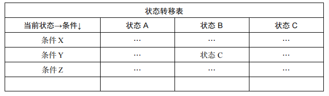

# 状态模式

定义：允许一个对象在其内部状态改变时改变它的行为，对象看起来似乎修改了它的类。

- 将状态封装成独立的类，并将请求委托给当前的状态对象，当对象的内部状态改变时，会带来不同的行为变化。
- 从客户的角度来看，我们使用的对象，在不同的状态下具有截然不同的行为，这个对象看起来是从不同的类中实例化而来的，实际上这是使用了委托的效果。


### 案例

#### 一、电灯开关状态从只有 开->关 两种到 开->弱光-> 强光-> 关 

```js
// 关闭
var OffLightState = function (light) {
    this.light = light;
};
OffLightState.prototype.buttonWasPressed = function () {
    console.log('弱光'); // offLightState 对应的行为
    this.light.setState(this.light.weakLightState); // 切换状态到 weakLightState
};
// 弱光
var WeakLightState = function (light) {
    this.light = light;
};
WeakLightState.prototype.buttonWasPressed = function () {
    console.log('强光'); // weakLightState 对应的行为
    this.light.setState(this.light.strongLightState); // 切换状态到 strongLightState
};
// 强光
var StrongLightState = function (light) {
    this.light = light;
};
StrongLightState.prototype.buttonWasPressed = function () {
    console.log('关灯'); // strongLightState 对应的行为
    this.light.setState(this.light.offLightState); // 切换状态到 offLightState
};

// 使用更加立体化的状态对象来记录当前状态
var Light = function () {
    this.offLightState = new OffLightState(this);
    this.weakLightState = new WeakLightState(this);
    this.strongLightState = new StrongLightState(this);
    this.button = null;
};

Light.prototype.init = function () {
    var button = document.createElement('button'),
        self = this;
    this.button = document.body.appendChild(button);
    this.button.innerHTML = '开关';
    this.currState = this.offLightState; // 设置当前状态对象
    this.button.onclick = function () {
        self.currState.buttonWasPressed();
    };
};

// 切换状态
Light.prototype.setState = function (newState) {
    this.currState = newState;
};
var light = new Light();
light.init();
```

#### **结论**：

1. 使用状态模式之前， this.currState 是个字符串，使用状态模式后，变成一个对象，对应状态的行为和其他属性可以独立在此状态内部，便于扩展；
2. 状态之间的切换都被分布在状态类内部，无需编写过多的 if、else 条件分支语言来控制状态之间的转换；

3. 使用状态模式的好处很明显，它可以使每一种状态和它对应的行为之间的关系局部化，这些行为被分散和封装在各自对应的状态类之中，便于阅读和管理代码。
4. 当需要新增一种状态时，只需要增加一种状态，最多稍稍改变一下现有代码即可；

#### 二、状态模式的通用结构

1. 上下文 Context 类 ,

   context 类持有对各种状态类的引用，以便把请求委托给各个状态对象；即左手接收外界发来的请求，右手就转交给目标状态对象来处理；

2. 各种状态类；

   上下文类被传入状态类的构造函数，让状态类持有上下文类的引用，以便操作上下文类的静态方法或者实例方法；状态类必须要实现一个同名方法，来处理上下文类转发的请求；可以使用抽象类的方式让状态类来继承，以避免状态类没有实现此方法；

   ```js
   // 上下文类
   var Light = function () {
       this.offLightState = new OffLightState(this); // 持有状态对象的引用
       this.weakLightState = new WeakLightState(this);
       this.strongLightState = new StrongLightState(this);
       this.superStrongLightState = new SuperStrongLightState(this);
       this.button = null;
   };
   Light.prototype.init = function () {
       var button = document.createElement('button'),
           self = this;
       this.button = document.body.appendChild(button);
       this.button.innerHTML = '开关';
       this.currState = this.offLightState; // 设置默认初始状态
       this.button.onclick = function () {
           // 定义用户的请求动作
           self.currState.buttonWasPressed();
       };
   };
   
   // 状态类
   var OffLightState = function (light) {
       this.light = light;
   };
   // 接收上下文类转发的请求
   OffLightState.prototype.buttonWasPressed = function () {
       console.log('弱光');
       this.light.setState(this.light.weakLightState);
   };
   
   //  抽象类
   var State = function () {};
   State.prototype.buttonWasPressed = function () {
       throw new Error('父类的 buttonWasPressed 方法必须被重写');
   };
   //  状态类，继承抽象类，以保证抽象类实例有 buttonWasPressed 方法；
   var SuperStrongLightState = function (light) {
       this.light = light;
   };
   SuperStrongLightState.prototype = new State(); // 继承抽象父类
   SuperStrongLightState.prototype.buttonWasPressed = function () {
       // 重写 buttonWasPressed 方法
       console.log('关灯');
       this.light.setState(this.light.offLightState);
   };
   ```

#### 三、上传文件时的状态机

```js
// 1.提供 window.external.upload 函数，在页面中模拟创建上传插件，
window.external.upload = function (state) {
    console.log(state); // 可能为 sign、uploading、done、error
};
var plugin = (function () {
    var plugin = document.createElement('embed');
    plugin.style.display = 'none';
    plugin.type = 'application/txftn-webkit';
    plugin.sign = function () {
        console.log('开始文件扫描');
    };
    plugin.pause = function () {
        console.log('暂停文件上传');
    };
    plugin.uploading = function () {
        console.log('开始文件上传');
    };
    plugin.del = function () {
        console.log('删除文件上传');
    };
    plugin.done = function () {
        console.log('文件上传完成');
    };
    document.body.appendChild(plugin);
    return plugin;
})();
// 2. 在构造函数中为每种状态子类都创建一个实例对象
var Upload = function (fileName) {
    this.plugin = plugin;
    this.fileName = fileName;
    this.button1 = null;
    this.button2 = null;
    this.signState = new SignState(this); // 设置初始状态为 waiting
    this.uploadingState = new UploadingState(this);
    this.pauseState = new PauseState(this);
    this.doneState = new DoneState(this);
    this.errorState = new ErrorState(this);
    this.currState = this.signState; // 设置当前状态
};
// Upload.prototype.init 负责往页面中创建跟上传流程有关的 DOM 节点，并开始绑定按钮的事件：
Upload.prototype.init = function () {
    var that = this;
    this.dom = document.createElement('div');
    this.dom.innerHTML =
        '<span>文件名称:' +
        this.fileName +
        '</span>\
<button data-action="button1">扫描中</button>\
<button data-action="button2">删除</button>';
    document.body.appendChild(this.dom);
    this.button1 = this.dom.querySelector('[data-action="button1"]');
    this.button2 = this.dom.querySelector('[data-action="button2"]');
    this.bindEvent();
};
//  负责具体的按钮事件实现，在点击了按钮之后，Context 并不做任何具体的操作，
// 而是把请求委托给当前的状态类来执行：
Upload.prototype.bindEvent = function () {
    var self = this;
    this.button1.onclick = function () {
        self.currState.clickHandler1();
    };
    this.button2.onclick = function () {
        self.currState.clickHandler2();
    };
};
// 第四步，我们把状态对应的逻辑行为放在 Upload 类中：
Upload.prototype.sign = function () {
    this.plugin.sign();
    this.currState = this.signState;
};
Upload.prototype.uploading = function () {
    this.button1.innerHTML = '正在上传，点击暂停';
    this.plugin.uploading();
    this.currState = this.uploadingState;
};
Upload.prototype.pause = function () {
    this.button1.innerHTML = '已暂停，点击继续上传';
    this.plugin.pause();
    this.currState = this.pauseState;
};
Upload.prototype.done = function () {
    this.button1.innerHTML = '上传完成';
    this.plugin.done();
    this.currState = this.doneState;
};
Upload.prototype.error = function () {
    this.button1.innerHTML = '上传失败';
    this.currState = this.errorState;
};
Upload.prototype.del = function () {
    this.plugin.del();
    this.dom.parentNode.removeChild(this.dom);
};
// 第五步，编写各个状态类的实现。值得注意的是，使用了
// StateFactory，从而避免因为 JavaScript 中没有抽象类所带来的问题。
var StateFactory = (function () {
    var State = function () {};
    State.prototype.clickHandler1 = function () {
        throw new Error('子类必须重写父类的 clickHandler1 方法');
    };
    State.prototype.clickHandler2 = function () {
        throw new Error('子类必须重写父类的 clickHandler2 方法');
    };
    return function (param) {
        var F = function (uploadObj) {
            this.uploadObj = uploadObj;
        };
        F.prototype = new State();
        for (var i in param) {
            F.prototype[i] = param[i];
        }
        return F;
    };
})();
var SignState = StateFactory({
    clickHandler1: function () {
        console.log('扫描中，点击无效...');
    },
    clickHandler2: function () {
        console.log('文件正在上传中，不能删除');
    },
});
var UploadingState = StateFactory({
    clickHandler1: function () {
        this.uploadObj.pause();
    },
    clickHandler2: function () {
        console.log('文件正在上传中，不能删除');
    },
});

// 测试代码
var uploadObj = new Upload('JavaScript 设计模式与开发实践');
uploadObj.init();
window.external.upload = function (state) {
    uploadObj[state]();
};
window.external.upload('sign');
setTimeout(function () {
    window.external.upload('uploading'); // 1 秒后开始上传
}, 1000);
setTimeout(function () {
    window.external.upload('done'); // 5 秒后上传完成
}, 5000);
```


#### 四、JavaScript 版本的状态机(FSM)

状态模式是状态机的实现之一，但在 JavaScript 这种“无类”语言中，没有规定让状态对象一定要从类中创建而来。另外一点，JavaScript 可以非常方便地使用委托技术，并不需要事先让一个对象持有另一个对象。下面的状态机选择了通过 Function.prototype.call 方法直接把请求委托给某个字面量对象来执行。 

```js
var Light = function () {
    this.currState = FSM.off; // 设置当前状态
    this.button = null;
};
Light.prototype.init = function () {
    var button = document.createElement('button'),
        self = this;
    button.innerHTML = '已关灯';
    this.button = document.body.appendChild(button);
    this.button.onclick = function () {
        self.currState.buttonWasPressed.call(self); // 把请求委托给 FSM 状态机
    };
};
//  状态机 FSM
var FSM = {
    off: {
        buttonWasPressed: function () {
            console.log('关灯');
            this.button.innerHTML = '下一次按我是开灯';
            this.currState = FSM.on;
        },
    },
    on: {
        buttonWasPressed: function () {
            console.log('开灯');
            this.button.innerHTML = '下一次按我是关灯';
            this.currState = FSM.off;
        },
    },
};
var light = new Light();
light.init();
```


#### 换一种方式实现

面向对象设计和闭包互换，前者把变量保存为对象的属性，而后者把变量封闭在闭包形成的环境中

```js
var delegate = function (client, delegation) {
    return {
        buttonWasPressed: function () {
            // 将客户的操作委托给 delegation 对象
            return delegation.buttonWasPressed.apply(client, arguments);
        },
    };
};
var FSM = {
    off: {
        buttonWasPressed: function () {
            console.log('关灯');
            this.button.innerHTML = '下一次按我是开灯';
            this.currState = this.onState;
        },
    },
    on: {
        buttonWasPressed: function () {
            console.log('开灯');
            this.button.innerHTML = '下一次按我是关灯';
            this.currState = this.offState;
        },
    },
};
var Light = function () {
    this.offState = delegate(this, FSM.off); // 代理生成状态对象
    this.onState = delegate(this, FSM.on);
    this.currState = this.offState; // 设置初始状态为关闭状态
    this.button = null;
};
Light.prototype.init = function () {
    var button = document.createElement('button'),
        self = this;
    button.innerHTML = '已关灯';
    this.button = document.body.appendChild(button);
    this.button.onclick = function () {
        self.currState.buttonWasPressed();
    };
};
var light = new Light();
light.init();
```

### 表驱动的有限状态机

这种方法的核心是基于表驱动的。在表中很清楚地看到下一个状态是由当前状态和行为共同决定的。这样一来，我们就可以在表中查找状态，而不必定义很多条件分支。核心就是，**某种状态遇到某种条件会切换到另一种状态**；



如上，状态 B 遇到条件Y 就切换到状态 C ；

对应的库有  **javascript-state-machine**  ；

#### 状态机的其他几种应用场景

- 一个下拉菜单在 hover 动作下有显示、悬浮、隐藏等状态；
- 一次 TCP 请求有建立连接、监听、关闭等状态；
- 一个格斗游戏中人物有攻击、防御、跳跃、跌倒等状态。


### 状态模式优缺点

##### 优点：

- 状态模式定义了状态与行为之间的关系，并将它们封装在一个类里。通过增加新的状态

类，很容易增加新的状态和转换。

- 避免 Context 无限膨胀，状态切换的逻辑被分布在状态类中，也去掉了 Context 中原本过

多的条件分支。

- 用对象代替字符串来记录当前状态，使得状态的切换更加一目了然。

- Context 中的请求动作和状态类中封装的行为可以非常容易地独立变化而互不影响。

##### 缺点

- 会在系统中定义许多状态类，这是一项枯燥乏味的工作，而且系统中会因此而增加不少对象。
- 逻辑分散在状态类中，虽然避开了条件分支语句，但也造成了逻辑分散的问题，无法在一个地方就看出整个状态机的逻辑；

### 状态模式中的性能优化点

- 有两种选择来管理 state 对象的创建和销毁。第一种是仅当 state 对象被需要时才创建并随后销毁，另一种是一开始就创建好所有的状态对象，并且始终不销毁它们。如果 state对象比较庞大，可以用第一种方式来节省内存，这样可以避免创建一些不会用到的对象并及时地回收它们。但如果状态的改变很频繁，最好一开始就把这些 state 对象都创建出来，也没有必要销毁它们，因为可能很快将再次用到它们。
- 各 Context 对象可以共享一个 state 对象，这也是享元模式的应用场景之一。

### 状态模式和策略模式的关系

- 策略模式和状态模式的相同点是，它们都有一个上下文、一些策略或者状态类，上下文把请求委托给这些类来执行。

- 区别是策略模式中的各个策略类之间是平等又平行的，它们之间没有任何联系，所以客户必须熟知这些策略类的作用，以便客户可以随时主动切换算法；而在状态模式中，状态和状态对应的行为是早已被封装好的，状态之间的切换也早被规定完成，“改变行为”这件事情发生在状态模式内部。对客户来说，并不需要了解这些细节。这正是状态模式的作用所在。


### 


