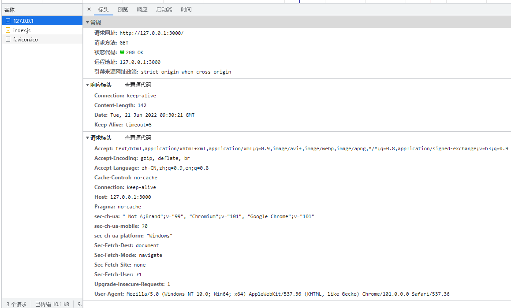
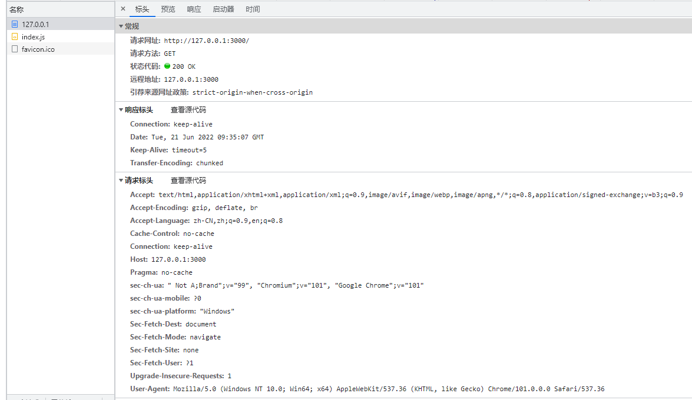

使用 res.send 方式响应

```js
const html = fs.readFileSync("./index.html");

const server = http.createServer((req, res) => res.end(html));
```



使用 createReadStream 方式响应

```js
const html = fs.readFileSync("./index.html");
const server = http.createServer((req, res) => {
  fs.createReadStream("./index.html").pipe(res);
});
```



如果使用 res.write(chunk) ， res 就会边写入边向浏览器响应，同时进行，此时无法写入响应 headers；

```js
const rs = fs.createReadStream("./index.html");
let arr = [];

rs.on("data", function (chunk) {
    arr.push(chunk); //chunk是buffer类型
    res.write(chunk);
});

//Buffer.concat合并小buffer
rs.on("end", function (chunk) {
    // 此时 res 已经发送出去，无法再写入 header
    const content = Buffer.concat(arr).toString();
    res.setHeader("Content-Length", content.length);
    res.end(); // 最后需要调用 res.end， 否则响应不会终止，页面将一直处于加载中
});

rs.on("error", function (err) {
    console.log(err);
});
```


作业

- 初阶：继续完善静态服务器，使其基于 stream，并能给出正确的 Content-Length。

  ```js
  const rs = fs.createReadStream("./index.html");
  let arr = [];
  rs.on("data", function (chunk) {
      arr.push(chunk); //chunk是buffer类型
  });
  
  //Buffer.concat合并小buffer
  rs.on("end", function (chunk) {
      const content = Buffer.concat(arr).toString();
      res.setHeader("Content-Length", content.length);
      res.end(content);
  });
  ```

  

- 高阶：继续完善静态服务器，使其作为一个命令行工具，支持指定端口号、读取目录、404、stream (甚至 trailingSlash、cleanUrls、rewrite、redirect 等)。可参考 [serve-handler (opens new window)](https://github.com/vercel/serve-handler)。

- 面试：什么是 rewrite 和 redirect