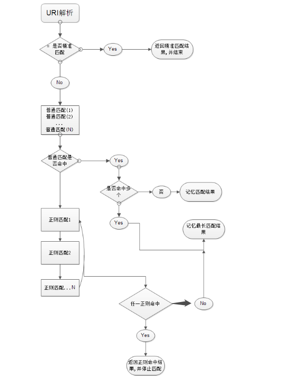
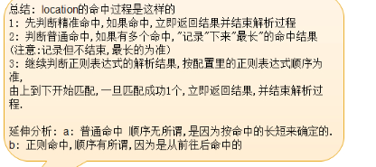
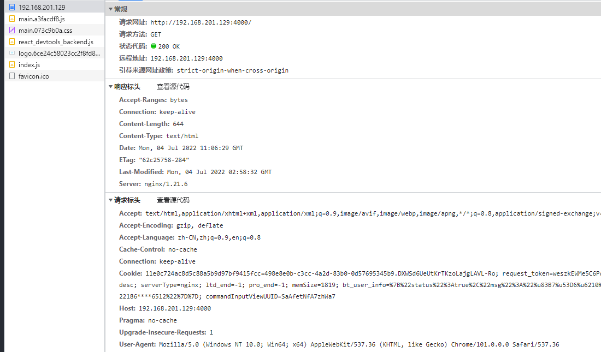
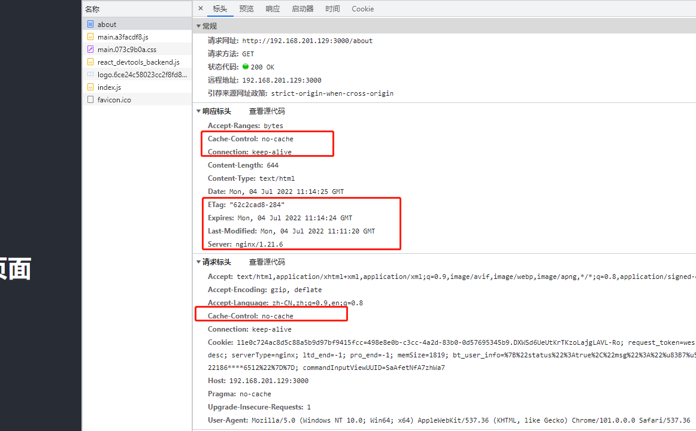
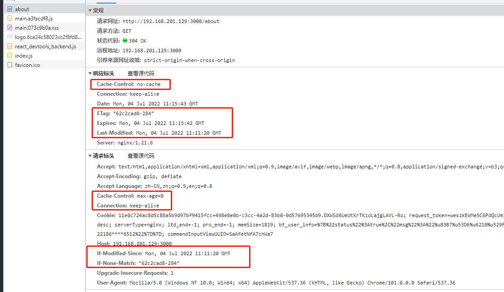

使用 res.send 方式响应

```js
const html = fs.readFileSync("./index.html");

const server = http.createServer((req, res) => res.end(html));
```


使用 createReadStream 方式响应

```js
const html = fs.readFileSync("./index.html");
const server = http.createServer((req, res) => {
  fs.createReadStream("./index.html").pipe(res);
});
```


如果使用 res.write(chunk) ， res 就会边写入边向浏览器响应，同时进行，此时无法写入响应 headers；

```js
const rs = fs.createReadStream("./index.html");
let arr = [];

rs.on("data", function (chunk) {
    arr.push(chunk); //chunk是buffer类型
    res.write(chunk);
});

//Buffer.concat合并小buffer
rs.on("end", function (chunk) {
    // 此时 res 已经发送出去，无法再写入 header
    const content = Buffer.concat(arr).toString();
    res.setHeader("Content-Length", content.length);
    res.end(); // 最后需要调用 res.end， 否则响应不会终止，页面将一直处于加载中
});

rs.on("error", function (err) {
    console.log(err);
});
```


## 作业01

- 初阶：继续完善静态服务器，使其基于 stream，并能给出正确的 Content-Length。

  ```js
  const rs = fs.createReadStream("./index.html");
  let arr = [];
  rs.on("data", function (chunk) {
      arr.push(chunk); //chunk是buffer类型
  });
  
  //Buffer.concat合并小buffer
  rs.on("end", function (chunk) {
      const content = Buffer.concat(arr).toString();
      res.setHeader("Content-Length", content.length);
      res.end(content);
  });
  ```

  Nginx1.7.3及以上的版本默认开启Etag特性；

  

- 高阶：继续完善静态服务器，使其作为一个命令行工具，支持指定端口号、读取目录、404、stream (甚至 trailingSlash、cleanUrls、rewrite、redirect 等)。可参考 [serve-handler (opens new window)](https://github.com/vercel/serve-handler)。

  > 代码参考 https://github.com/shfshanyue/mini-code/tree/master/code/serve

- 面试：什么是 rewrite 和 redirect

  ##### redirect

  通过重定向，浏览器知道页面位置发生变化，从而改变地址栏显示的地址。

  通过重定向，搜索引擎意识到页面被移动了，从而更新搜索引擎索引，将原来失效的链接从搜索结果中移除。

  临时重定向(R=302)和永久重定向(R=301)都是亲搜索引擎的，是SEO的重要技术。

  redirect是浏览器和服务器发生两次请求，也就是服务器命令客户端“去访问某个页面”；

  redirect的URL需要传送到客户端。

  redirect是从一个地址跳转到另一个地址。

  #### rewrite 

  rewrite的URL只是在服务器端

  rewrite则是服务器内部的一个接管，在服务器内部告诉“某个页面请帮我处理这个用户的请求”，浏览器和服务器只发生一次交互，浏览器不知道是该页面做的响应，浏览器只是向服务器发出一个请求。

  URL重写用于将页面映射到本站另一页面，若重写到另一网络主机（域名），则按重定向处理。

  rewrite是把一个地址重写成另一个地址。地址栏不跳转。相当于给另一个地址加了一个别名一样。


centos 安装 git

```sh
sudo yum install -y git
git --version #查看 git 版本
```

拉取代码

```sh
git clone xxx
```

构建镜像

> 如果有多个 dockerfile 文件，就需要指定构建配置文件， --file 或 -f

```sh
# --file 简写 -f 指定 dockerfile 文件, 不指定时默认为当前目录的 Dockerfile 文件
# -t 给此镜像加个name， name后的是tag, 镜像名为 simple-app, tag 是0.1
# . 表示 Dockerfile 文件所在位置为当前目录
docker build -t simple-app:0.1 . --file node.Dockerfile 
```

根据该镜像运行容器 

```bash
# 如果需要在后台运行则添加 -d 选项
# --rm: 当容器停止运行时，自动删除容器
# -p: 3000:3000，将容器中的 3000 端口映射到宿主机的 3001 端口
$ docker run --rm -p 3001:3000 simple-app

# 运行成功后可在另一个窗口查看所有容器
$ docker ps -a
CONTAINER ID   IMAGE        COMMAND                  CREATED          STATUS          PORTS                                       NAMES
50784910f758   simple-app   "docker-entrypoint.s…"   20 seconds ago   Up 20 seconds   0.0.0.0:3000->3000/tcp, :::3000->3000/tcp   wizardly_solomon
```

## 作业02

- 初阶: 通过 docker/docker-compose 将单文件 html 进行部署

- 面试: 我们为什么可以直接在 node 镜像中使用 yarn 命令行工具

  ```bash
  我们选择 node:14-alpine (opens new window)作为基础镜像，其中基于轻量操作系统 alpine，内置了 node14/npm/yarn 等运行环境。
  ```


docker-compose 构建

```bash
# up: 创建并启动容器
# --build: 每次启动容器前构建镜像
# --detach 后台运行，简写 -d
$ docker-compose up --build --detach
```

如果代码有改动，构建时就会生成新的临时镜像，而主镜像也会更新；代码没有改动时，镜像不会发生变化，会使用旧的镜像离开运行容器；

如果不使用后台运行 -d ，从 docker-compose 命令退出时，会停止容器的运行， 但容器会继续存在；可以对这些容器单个运行；

### 用 docker 学习 nginx

1. 直接访问某个 nginx 镜像的默认页面

   ```sh
   # -p 3000:80，在本地 3006 端口访问 nginx 页面
   # --rm: 当容器停止运行时，自动删除容器
   # sh 进入容器环境中
   $ docker run -it --rm -p 3006:80 nginx:alpine
   ```

2. 进入容器环境中

   ```sh
   $ docker run -it --rm nginx:alpine sh # 进入容器
   ```

3. 查看下容器内有哪些文件

   ```sh
   ls -lah /etc/nginx/
   ```

   得到如下结果

   ```sh
   total 40K    
   drwxr-xr-x    3 root     root        4.0K Nov 13  2021 .
   drwxr-xr-x    1 root     root        4.0K Jun 14 07:55 ..
   drwxr-xr-x    2 root     root        4.0K Nov 13  2021 conf.d
   -rw-r--r--    1 root     root        1.1K Nov  2  2021 fastcgi.conf
   -rw-r--r--    1 root     root        1007 Nov  2  2021 fastcgi_params
   -rw-r--r--    1 root     root        5.2K Nov  2  2021 mime.types
   lrwxrwxrwx    1 root     root          22 Nov 13  2021 modules -> /usr/lib/nginx/modules
   -rw-r--r--    1 root     root         648 Nov  2  2021 nginx.conf
   -rw-r--r--    1 root     root         636 Nov  2  2021 scgi_params
   -rw-r--r--    1 root     root         664 Nov  2  2021 uwsgi_params
   ```

4. 查看 nginx 默认配置

   ```sh
   # 该命令在 nginx 的容器中执行
   $ locacat /etc/nginx/conf.d/default.conf
   ```

   得到内容

   ```sh
   server {
       listen       80;
       server_name  localhost;
       location / {
           root   /usr/share/nginx/html;
           index  index.html index.htm;
       }
       error_page   500 502 503 504  /50x.html;
       location = /50x.html {
           root   /usr/share/nginx/html;
       }
   }
   ```

   该配置文件做了以下两个事情。

   1. 监听本地 80 端口
   2. 为 `/usr/share/nginx/html` 目录做静态资源服务

4. 修改 nginx 配置即时查看效果。
   - 用数据卷技术，在文件中修改 nginx 配置，同步到 nginx 容器中，然后重启容器查看效果；
   - 使用 ADD ，将文件内容覆盖到 nginx 容器的配置中，再重启容器查看效果；
   - 直接进入容器中修改，这种不推荐；

#### 方式1、使用数据卷技术修改 nginx.conf

learn-nginx.docker-compose.yaml

```yaml
# 通过此配置可在 Docker 环境中学习 nginx 的各种指令
# 如果需要修改配置，验证配置是否生效，可通过 docker-compose 重新启动该容器 (或者 npm run learn:nginx)
version: "3"
services:
  learn-nginx:
    image: nginx:alpine
    ports:
      - 4000:80
    volumes:
# learn-nginx.docker-compose.yaml 所在目录下的 nginx.conf文件与容器中的 /etc/nginx/conf.d/default.conf 文件同步
      - ./nginx.conf:/etc/nginx/conf.d/default.conf
      - .:/usr/share/nginx/html
```

用 vim 进入 nginx.conf 修改然后重启 docker-compose 即可；

#### 方式2、使用 ADD 方式修改 nginx.conf 

```sh
version: "3"
services:
  nginx-app:
    build:
      context: .
      dockerfile: nginx.Dockerfile
    ports:
      - 4001:80
```

1. 编写 Dockerfile 文件，在其中 ADD nginx.conf ，目标是  /usr/share/nginx/
2. 编写 docker-compose.yaml 文件，在里面使用上述 Dockerfile 文件，
3. 用 docker-compose.yaml 构建镜像和容器运行；
4. 修改 nginx.conf ，docker-compose 构建运行；

#### 两种方式对比：

1. 数据卷方式指定仓库上的镜像，用数据卷来同步更新 配置文件和代码；

2. ADD 方式使用 dockerFile 文件来自定义镜像，用 ADD 方式来同步配置文件和代码；

3. 如果 ADD 方式的 FROM 和 数据卷方式使用的是同一个镜像，那二者没有本质上区别，仅仅是使用形式不同；

4. 启动方式相同;

   ```sh
   docker-compose -f learn-nginx.docker-compose.yaml up -d --build  learn-nginx
   ```


## nginx 的 location 命中匹配流程

```sh
# =  精确匹配。优先级最高
# ^~ 前缀匹配，优先级其次
# ~  正则匹配，优先级再次 (~* 只是不区分大小写，不单列)
# /  通用前缀匹配，优先级再次
```







1. 在 location有多个时，从上向下优先判断是否命中了 = 精准匹配，匹配上了就直接返回结果并结束匹配过程；
2. 如果没有命中精准匹配，就判断普通命中，若有多个就记录下来，找到其中最长的命中结果，保存下来；
3. 继续判断正则表达式的匹配结果，从上向下，若匹配到了就立即返回该匹配作为最终结果，并结束全部匹配过程；若没有匹配到，就用上一步最长的普通匹配作为最终匹配结果；

location 分析

```nginx
location = / {
     root   /var/www/html/;
     index  index.htm index.html;
}

location / {
     root   /usr/local/nginx/html;
     index  index.html index.htm;
}

location配置如上,若访问http://xxx.com/，定位的流程是：
1:精准匹配命中"/",得到index页为index.htm,所以请求的地址变为http://xxx.com/index.htm
2:再次匹配"/index.htm",此次内部转跳uri已经是"/index.htm",命中普通匹配"/",根目录为/usr/local/nginx/html
3:最终结果,访问了/usr/local/nginx/html/index.htm
```


```nginx
location  / {
    root   /usr/local/nginx/html;
    index  index.html index.htm;
}

location ~ image {
    root   /var/www/;
    index  index.html;
}

如果我们访问http://xx.com/image/logo.png。此时uri为"/image/logo.png"命中了普通匹配"/",也命中了正则匹配"~ image"，但是根据上述图片中匹配过程分析,最终是正则匹配生效。

所以最终访问地址为:/var/www/image/logo.png。如果你想最终的匹配路径为/var/www/logo.png可以把正则匹配中的"root   /var/www/";修改为"alias   /var/www/"
```

对 index.html 配置强缓存

```nginx
location / {
    # expires -1;  # 不缓存
	expires 60;  # 缓存 60s
    add_header X-Hello shanyue;
    add_header X-Config A;

    # 所有找不到的路径都会默认走 /index.html 页面
    # cleanUrls: try_files $uri $uri.html; 可省略 .html 后缀直接访问
    try_files  $uri $uri.html $uri/index.html /index.html;
}
```


响应头定义上 Expires: 60 ，当客户端第一次访问时，请求头会默认带上 Cache-Control: no-cache ；在 Expoires 期限内， 客户端再访问就会在请求头带上 Cache-Control: max-age=60

问题：

1. max-age 应该是60， 为何变成 0 ？；
2. nginx 的 Etag 怎么生成的？
3. proxy_pass http://api:3000;   是什么写法？ 
   api 是域名 

### 作业03

- 初阶: 基于 docker 将极简前端项目进行部署
- 面试: 我们的基础镜像 tag 总是携带 `alpine`，它是什么
- 初阶: 基于 docker 学习 nginx 配置，并可配置 index.html 强缓存 60s 时间
- 中阶: 如何使用 nginx 与 whoami 镜像，模拟 502/504
- 高阶: 基于 docker 学习 nginx 配置，并可配置 gzip/brotli
- 面试: brotli/gzip 有何区别

# 单页构建部署

#### 1.生成 Dockfile 

```sh
$ yarn
$ npm run build
$ npx serve -s build
```

将命令通过以下几步翻译为一个 Dockerfile：

1. 选择一个基础镜像。由于需要在容器中执行构建操作，我们需要 node 的运行环境，因此 `FROM` 选择 node。
2. 将以上几个脚本命令放在 `RUN` 指令中。
3. 启动服务命令放在 `CMD` 指令中。

```dockerfile
FROM node:14-alpine

WORKDIR /code

ADD . /code
RUN yarn && npm run build

CMD npx serve -s build
EXPOSE 3000
```

构建完成。然而还可以针对以下两点进行优化。

1. 构建镜像时间过长，**优化构建时间**。
2. 构建镜像文件过大，**优化镜像体积**。


单页应用构建步骤

1. 在 code 目录内拉取代码，其中包含构建文件；

   ```sh
   git clone  xxx.git
   ```

2. 执行以下命令构建镜像并启动容器；

   ​	过程：使用多阶段构建进行优化，最终使用 nginx 进行服务化。

   1. 第一阶段 Node 镜像：使用 node 镜像对单页应用进行构建，生成静态资源。
   2. 第二阶段 Nginx 镜像：使用 nginx 镜像对单页应用的静态资源进行服务化

   ```sh
   docker-compose up -d --build simple
   ```

3. 中途发现 4000 端口被占用，关闭对应服务后，再执行上述命令重新启动容器；

4. 单页第一次构建成功后，只要依赖没有发生变化，后续构建镜像速度很快，即使删掉原有镜像重新构建也很快；使用 nginx启动后镜像大小 24M， 使用node 端的 serve 来启动，镜像大小 424MB；

   - serve 启动

   > 1. 选择一个基础镜像。由于需要在容器中执行构建操作，我们需要 node 的运行环境，因此 `FROM` 选择 node。
   > 2. 将以上几个脚本命令放在 `RUN` 指令中。
   > 3. 启动服务命令放在 `CMD` 指令中。

   镜像大小 424MB

   ```dockerfile
   FROM node:14-alpine
   
   WORKDIR /code
   
   ADD . /code
   RUN yarn && npm run build
   
   CMD npx serve -s build
   EXPOSE 80
   ```

   

   - nginx 启动

     镜像大小 24MB

     ```dock
     FROM node:14-alpine as builder
     
     WORKDIR /code
     
     # 单独分离 package.json，是为了安装依赖可最大限度利用缓存
     ADD package.json yarn.lock /code/
     RUN yarn
     
     ADD . /code
     RUN npm run build
     
     # 选择更小体积的基础镜像
     FROM nginx:alpine
     COPY --from=builder code/build /usr/share/nginx/html
     ```

   #### 启动容器

   > docker-compose up --build -d simple

   访问 `http://localhost:4000` 页面成功。

   ```dockerfile
   version: "3"
   services:
     simple:
       build:
         context: .
         dockerfile: simple.Dockerfile
       ports:
         - 4000:80
   ```

   

   ### 作业04

   - 初阶：完成基于单页应用的多阶段构建及缓存优化
   - 高阶：为什么我们前端需要使用多阶段构建，多阶段构建还有什么场景
   - 面试：在你对镜像体积优化后，前后镜像体积对比是多少？ 24/424


# 单页应用部署问题

## 1、路由到 /about ，出现 404 问题

问题原因：**在静态资源中并没有 `about` 或者 `about.html` 该资源，因此返回 404 Not Found。而在单页应用中，`/about` 是由前端通过 `history API` 进行控制。**

解决方法：**在服务端将所有页面路由均指向 `index.html`，而单页应用再通过 `history API` 控制当前路由显示哪个页面。** 这也是静态资源服务器的重写(`Rewrite`)功能。

> 解决办法，nginx 配置

```nginx
location / {
    # 如果资源不存在，则回退到 index.html
    try_files  $uri $uri/ /index.html;  
}
```

## 2、资源缓存问题

对带有 hash 值的资源，可以长期缓存，通过 `expires` 对它们配置一年的长期缓存，它实际上是配置了 `Cache-Control: max-age=31536000` 的响应头。内容一旦改变会生成新的 hash，会访问到最新资源；

```nginx
location /static {
    expires 1y;
}
```

总结缓存策略如下:

1. 带有 hash 的资源一年长期缓存；
2. 非带 hash 的资源，如 index.html 文件，需要配置 Cache-Control: no-cache，**避免浏览器默认为强缓存**

以上两个问题解决最终 nginx 配置如下：

```ng
server {
    listen       80;
    server_name  localhost;

    root   /usr/share/nginx/html;
    index  index.html index.htm;

    location / {
        # 解决单页应用服务端路由的问题
        try_files  $uri $uri/ /index.html;  

        # 非带 hash 的资源，需要配置 Cache-Control: no-cache，避免浏览器默认为强缓存,再次请求时就会有 Cache-Control: max-age=0 ，会加载到最新内容;
        expires -1;
    }

    location /static {
        # 带 hash 的资源，需要配置长期缓存
        expires 1y;
    }
}
```


增加配置前



增加配置后：

- 第一次

  

- 第二次

  

  