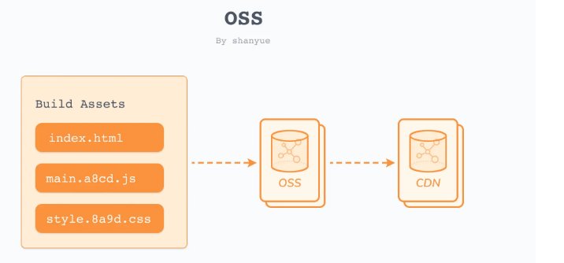

### 对象存储




1. 到 阿里云 oss 上创建 bucket ;

   > 设置权限为公共读；

2. 剩余的操作到 dockerFile 中完成；

   - 安装 ossutil 工具；
     - 运行以下命令下载ossutil；

       ```sh
       wget https://gosspublic.alicdn.com/ossutil/1.7.13/ossutil64
       ```

     - 运行一下命令修改文件执行权限；

       ```sh
       chmod 755 ossutil64 
       ```

     - 使用交互式配置生成配置文件；

       ```sh
       # 1.输入配置命令
       ./ossutil64 config
       # 2.根据提示设置配置文件路径,建议直接按回车使用默认配置文件的路径。
       # 3.根据提示设置工具的语言
       # 4.根据提示分别设置Endpoint、AccessKey ID、AccessKey Secret和STSToken(使用STS临时授权账号访问OSS时需要配置该项，否则置空即可)参数;
       ```

     - 上传资源前，通过 `ossutil config` 进行权限配置；

       ```sh
       ossutil config -i $ACCESS_KEY_ID -k $ACCESS_KEY_SECRET -e $ENDPOINT
       ```

   

3. 配置环境变量并传递到 dockerfile 文件中；

   > 需要设置 ACCESS_KEY_ID，ACCESS_KEY_SECRET 等信息，这些敏感信息不能写在代码中；

   - 执行以下命令查看当前的shell 是哪个,

     ```sh
     echo $SHELL  # 输出 /bin/zsh 或 /bin/bash
     ```

   - 执行以下命令进入文件中

     ```sh
     vim ~/.zshrc  # shell 是 /bin/zsh
     vim ~/.bashrc # shell 是 /bin/bash
     ```

   - 在上述文件中写入环境变量 ,  变量的值需要从阿里云 oss 中获取；

     > 获取AccessKey   https://help.aliyun.com/document_detail/53045.html   

     ```sh
     export ACCESS_KEY_ID=LTshanyueoworlJEdoPhello
     export ACCESS_KEY_SECRET=bhZHelloShanzOxsHelloshanIyueM
     ```

   - 修改上传脚本中的变量值

     ```js
     const client = new OSS({
       region: 'oss-cn-beijing', // 自己的
       accessKeyId: process.env.ACCESS_KEY_ID,
       accessKeySecret: process.env.ACCESS_KEY_SECRET,
       bucket: 'shanyue-cra' // 阿里云对应的 bucket 名
     })
     ```

   - 修改 oss.Dockerfile 文件中的 PUBLIC_URL 值

     > 在 `create-react-app` 中，对 `webpack config` 做了进一步封装，阅读其源码，了解其 `webpack.config.js` 配置，可知**在 `cra` 中通过设置环境变量 PUBLIC_URL 即可配置 CDN 地址**。
     >
     > 使用 [ARG (opens new window)](https://docs.docker.com/engine/reference/builder/#arg)作为变量传入。而 ARG 可通过 `docker build --build-arg` 抑或 `docker-compose` 进行传入。

     ```sh
     FROM node:14-alpine as builder
     
     ARG ACCESS_KEY_ID
     ARG ACCESS_KEY_SECRET
     ARG ENDPOINT
     ENV PUBLIC_URL https://shanyue-cra.oss-cn-beijing.aliyuncs.com/
     ```

4. 流程总结：
   - 配置环境变量到宿主机；
   - docker-compose 获取宿主机环境变量，通过 build.args 将宿主机的环境变量传递给 Dockerfile； 

### 作业06

- 初阶: 使用 ossutil 上传文件至 oss    -- done

- 中阶: 使用 gatsby/vuepress 搭建个人博客，并使用 vercel 等部署

- 高阶: 使用 gatsby/vuepress 搭建个人博客，并使用 oss 部署 (通过 npm scripts 部署即可)

- 面试: 我们如何向 Dockerfile 中传递宿主机环境变量；

  


